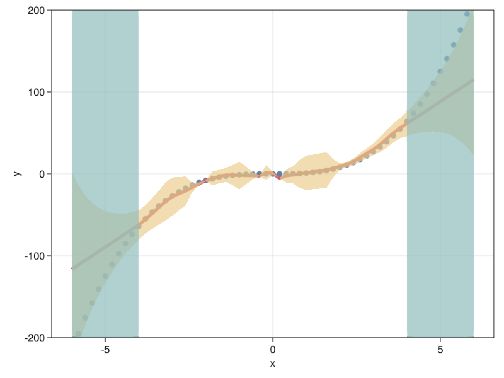

# EvidentialFlux

[](https://github.com/DoktorMike/EvidentialFlux.jl/actions/workflows/documentation.yml)
[](https://doktormike.github.io/EvidentialFlux.jl/stable)
[](https://doktormike.github.io/EvidentialFlux.jl/dev)
[](https://github.com/SciML/SciMLStyle)
[](https://zenodo.org/badge/latestdoi/487830887)

This is a Julia implementation in Flux of the Evidential Deep Learning
framework. It strives to estimate heteroskedastic aleatoric uncertainty as well
as epistemic uncertainty along with every prediction made. All of it calculated
in one glorious forward pass. Boom!

## Installing

If you want bleeding edge you can install it directly from my repo like this:

```julia
using Pkg; Pkg.add(url="https://github.com/DoktorMike/EvidentialFlux.jl")
```

Otherwise just do

```julia
using Pkg; Pkg.add("EvidentialFlux.jl")
```

## For the impatient

Below is an example of how to train Deep Evidential Regression model, extract
the predictions as well as the epistemic and aleatoric uncertainty. For a more
elaborate example have a look in the examples folder.

```julia
using Flux
using EvidentialFlux

x = Float32.(-4:0.1:4)
y = x .^3 .+ randn(Float32, length(x)) .* 3

lr = 0.0005
m = Chain(Dense(1 => 100, relu), Dense(100 => 100, relu), Dense(100 => 100, relu), NIG(100 => 1))
opt = AdamW(lr, (0.89, 0.995), 0.001)
pars = Flux.params(m)
for epoch in 1:500
    grads = Flux.gradient(pars) do
        ŷ = m(x') 
        γ, ν, α, β = ŷ[1, :], ŷ[2, :], ŷ[3, :], ŷ[4, :]
        trnloss = Statistics.mean(nigloss2(y, γ, ν, α, β, 0.01, 2))
        trnloss
    end
    Flux.Optimise.update!(opt, pars, grads)
end

γ, ν, α, β = predict(m, x)
eu = epistemic(ν)
au = aleatoric(ν, α, β)
```

## Classification

Deep evidential modeling works for classification as well as for regression. In
the plot below you can see the epistemic uncertainty as a consequence of
position in the plot. The task is to separate three Gaussians in 2D. The code
for this example can be found in
[classification.jl](examples/classification.jl).


## Regression

In the case of a regression problem we utilize the NormalInverseGamma
distribution to model a type II likelihood function that then explicitely
models the aleatoric and epistemic uncertainty. The code for the example
producing the plot below can be found in
[regression.jl](examples/regression.jl).



## Summary

Uncertainty is crucial for the deployment and utilization of robust machine
learning in production. No model is perfect and each one of them have
their own strengths and weaknesses, but as a minimum requirement we should all
at least demand that our models report uncertainty in every prediction.
